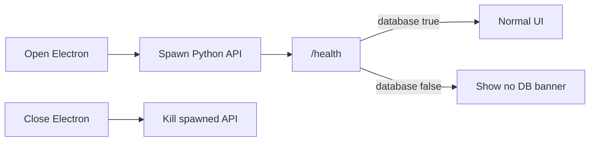

# 空库 · 桌面端（Electron）

## 生命周期（当前）

| 动作 | 行为 |
|------|------|
| 打开 Electron | **自动拉起** Python API（开发：`.venv/uvicorn`；打包：`resources/api/kongku-api`） |
| 关闭 Electron | **结束自己拉起的** API 子进程；若启动前端口上已有外部 API，则不杀 |
| 数据库进程 | **不启停**；仍用本机 Postgres（开发 Docker） |
| 无 Postgres | API 仍可启动；`/health` 与界面提示「未检测到数据库服务」 |
| 有 Postgres | API 启动时 `init_db` 自动建表 |



日常网页开发仍可：Vite + 手动 uvicorn + Docker Postgres，不必开 Electron。

## 目录

- `apps/desktop/electron/`：主进程 / preload  
- `apps/desktop/resources/api/`：API sidecar（`kongku-api` / `.exe`）  
- `apps/api/run_sidecar.py` + `scripts/build_sidecar.py`：打 sidecar  
- `.github/workflows/release-desktop.yml`：`v*` tag → win/mac/linux

## 本地试跑（验证启停同步）

1. 先停掉手动开的 API（确保 18765 空闲）  
2. 起 Docker Postgres（有库）或故意不起（验无库提示）  
3. 起 Vite（可选，开发壳连它）  
4. 开 Electron：

```powershell
cd apps/desktop
npm install
# 默认连 http://127.0.0.1:41779；不需要再设 KONGKU_SPAWN_API
npm run dev
```

验收：开壳后 18765 有进程；关壳后 18765 应退出。

## 本地打 sidecar + 安装包

```powershell
cd apps/api
.\.venv\Scripts\activate
pip install -r requirements.txt
python scripts/build_sidecar.py

cd ..\web
$env:ELECTRON="1"
npm run build

cd ..\desktop
npm install
npm run dist
```

产物在 `apps/desktop/release/`。

## GitHub 发版

推荐用脚本（默认 **patch 自增**，并推送 `v*` tag 触发 Actions）：

```powershell
# Windows
.\scripts\release-desktop.ps1              # v0.1.0 -> v0.1.1
.\scripts\release-desktop.ps1 -Bump minor  # -> v0.2.0
.\scripts\release-desktop.ps1 0.3.0        # 指定版本
.\scripts\release-desktop.ps1 -DryRun      # 只预览
```

```bash
# Git Bash / macOS / Linux
./scripts/release-desktop.sh
./scripts/release-desktop.sh --minor
./scripts/release-desktop.sh 0.3.0
```

手工方式：

```bash
git tag v0.1.0
git push origin v0.1.0
```

Actions「Release Desktop」会：装 Python 依赖 → PyInstaller sidecar → 打 Electron → 上传 Release。

### macOS 签名

未配置 Apple 证书时 `CSC_IDENTITY_AUTO_DISCOVERY=false`，仍可出包；用户可能需「右键 → 打开」。

## electron-updater

主进程已 `checkForUpdates`；前端可通过 `window.kongkuDesktop` 监听更新。
